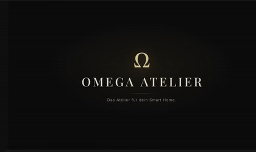
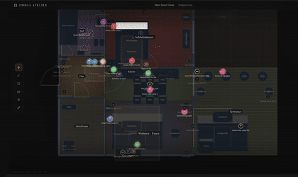

# OMEGA Atelier

<p align="center"><strong>Design your space. Visualize it in 3D. Connect it to the real world.</strong></p>

<p align="center">OMEGA Atelier is a spatial design and smart-home platform built around one idea:<br><em>your digital space should become the control layer for the real one.</em></p>

<p align="center"></p>

---

## The Product

OMEGA Atelier combines <strong>spatial planning, 3D visualization, digital-twin state, and smart-home connectivity</strong> in one environment.

Instead of treating a floor plan, a 3D scene and connected devices as separate tools, OMEGA Atelier brings them together into a shared model of the space.

You can design rooms, place and configure objects, visualize the result, connect real devices and reflect their live state back into the environment.

The result is not just a room planner.

It is a <strong>spatial operating layer for a connected home.</strong>

## A Product Experience, Not a Collection of Tools

### Design
Build and refine a spatial plan with rooms, walls, furniture and visual elements.

### Visualize
Move from a conventional floor plan into an interactive 3D representation of the space.

<p align="center"></p>

### Connect
Bring real devices into the same model through a connector-based architecture.

### Operate
Control compatible devices from the Digital Twin and see live state changes reflected in the application.

<p align="center"></p>

# Digital Twin

At the heart of OMEGA Atelier is a vendor-agnostic <strong>Digital Twin Runtime</strong>.

The application does not render individual vendor APIs directly. Devices are normalized into a common model consisting of:

- Devices
- Capabilities
- Connectors
- Room bindings
- Device state
- Health and synchronization state

The UI therefore remains independent from the underlying ecosystem.

A light can expose `OnOff`, `Brightness`, `Color` and `ColorTemperature`.

A lock can expose `Lock`. A blind can expose `Position`. A sensor can expose `Temperature` and `Humidity`. A camera can expose streaming and PTZ capabilities where supported.

The result is one interface for heterogeneous hardware.

# One Twin. Multiple Ecosystems.

OMEGA Atelier is built around a <strong>connector-first architecture</strong>.

Connectors translate vendor-specific APIs and transports into the neutral device model. The Digital Twin becomes the common layer consumed by the UI, scenes, automation logic and future integrations.

| Integration | Mode |
|---|---|
| Home Assistant | Live |
| Tuya Cloud | Live |
| SwitchBot Cloud | Live |
| Govee Cloud | Live |
| ONVIF cameras | Live / local bridge |
| MQTT | Connector architecture |
| Additional ecosystems | Extensible connector catalog |

Simulated ecosystems are also available for development, demonstrations and UI testing without physical hardware.

# Real Device Control

OMEGA Atelier is not limited to visualization. For supported live integrations, commands can travel from the interface through the connector layer to the actual device.

Examples include:

- Turn devices on or off
- Lock / unlock supported locks
- Adjust brightness
- Change color temperature
- Change color
- Position blinds / curtains
- Control supported camera PTZ functions
- Execute multi-device scenes

```text
OMEGA UI
   ↓
Digital Twin
   ↓
Connector
   ↓
Vendor transport / API
   ↓
Real device
```

Device updates return through the same abstraction and update the Digital Twin.

# Live State

The Digital Twin distinguishes between connected, connecting, disconnected and error states, as well as pending commands and confirmed state changes.

Commands use a predictive state layer so the interface can communicate that an action has been sent without pretending that a physical device has already confirmed it.

If confirmation arrives, the temporary command state disappears. If the transport fails or confirmation times out, the UI transitions into a controlled failure state instead of silently pretending everything worked.

# Smart-Home Scenes

OMEGA Atelier can operate devices across multiple connectors as one environment.

A scene represents a <strong>space-level intention</strong>, rather than a vendor-specific automation.

```text
"Evening"

Living room lights
      ↓
Curtains
      ↓
Connected devices
      ↓
Multiple ecosystems
      ↓
One coordinated scene
```

The scene engine operates on the neutral device model while individual connectors handle vendor-specific execution.

# Spatial Intelligence

The Digital Twin is connected to the actual floor-plan structure. Devices can be associated with rooms and visualized in the context of the space.

This enables the application to work with:

- Device-to-room assignments
- Live device state
- Available capabilities
- Active sources
- Unassigned devices
- Energy information where available
- Scene participation
- Spatial visualization

The floor plan becomes more than geometry.

<strong>It becomes an interface to the living system behind it.</strong>

# 3D Visualization

The 3D layer turns the plan into an interactive spatial representation for spatial exploration, furniture placement, material and texture visualization, architectural presentation, smart-home visualization and Digital Twin representation.

The 3D environment belongs to the same underlying project model rather than existing as a separate tool.

```text
Plan
 ↓
2D spatial representation
 ↓
3D visualization
 ↓
Digital Twin
 ↓
Connected environment
```

# Smart-Home Connectivity

OMEGA Atelier is designed as a <strong>connector platform</strong>, rather than locking the application to one hardware ecosystem.

```text
UI
│
├── Digital Twin
├── Connector Manager
└── Vendor Connectors
      ├── Home Assistant
      ├── Tuya
      ├── SwitchBot
      ├── Govee
      ├── ONVIF
      ├── MQTT
      └── Future integrations
```

<p align="center"></p>

# ONVIF Camera Integration

OMEGA Atelier can integrate ONVIF-compatible cameras through a local bridge. The bridge keeps LAN-specific ONVIF/SOAP communication outside the browser while exposing a controlled HTTP interface to the application.

```text
OMEGA Atelier
      ↓
Local ONVIF Bridge
      ↓
ONVIF / SOAP
      ↓
Camera
```

Depending on the camera, the Digital Twin can expose camera availability, snapshot support, stream information and PTZ support.

PTZ controls are only presented when the connected camera actually exposes the required PTZ service.

# Security Model

Credentials are treated as connector configuration rather than application-wide state.

Where appropriate, credentials are kept locally in the browser and are sent only to the configured integration endpoint. Sensitive ONVIF camera passwords are intentionally excluded from local persistence.

Cloud integrations use their respective authentication and signing mechanisms. Vendor credentials do not need to become part of the Digital Twin itself.

# Offline-First Foundation

OMEGA Atelier is designed around an offline-first philosophy. The application should remain useful as a design environment even when live integrations are unavailable.

```text
Design state
     ≠
Cloud availability
     ≠
Device availability
```

A missing cloud connector should not destroy the spatial project. A disconnected device should not invalidate the floor plan. The Digital Twin simply reflects the current health of the connected source.

# Architecture

```text
┌─────────────────────────────────────────┐
│                UI / UX                  │
│  Planner · 3D · Digital Twin · Scenes │
└───────────────────┬─────────────────────┘
                    │
┌───────────────────▼─────────────────────┐
│              Twin Manager               │
│   Sessions · Commands · Bindings        │
└───────────────────┬─────────────────────┘
                    │
┌───────────────────▼─────────────────────┐
│         Digital Twin Runtime            │
│ Devices · Capabilities · State · Health│
└───────────────────┬─────────────────────┘
                    │
┌───────────────────▼─────────────────────┐
│              Connectors                 │
│ HA · Tuya · SwitchBot · Govee · ONVIF │
│ MQTT · Ecosystems · Future adapters    │
└─────────────────────────────────────────┘
```

The key architectural boundary is the Digital Twin. The core does not need to know which vendor owns a device.

# Technology

OMEGA Atelier is built as a modern web application using technologies including:

- React
- TypeScript
- Vite
- Three.js / 3D rendering
- Supabase
- PWA capabilities
- Vitest
- Playwright
- Connector-based integration architecture

The project separates application logic, domain models, transports and UI concerns.

# Quality Gates

The development workflow includes:

- TypeScript validation
- ESLint
- Unit tests
- Build verification
- UI / browser testing
- Connector-specific tests

The objective is simple: <strong>new integrations should extend the system without destabilizing the existing Digital Twin.</strong>

# Design Philosophy

### Connector First
Hardware integrations belong behind connectors.

### Digital Twin First
The application works with normalized device state rather than vendor-specific UI logic.

### Offline First
Design functionality should not depend on cloud availability.

### Spatial First
Rooms and devices belong to a physical context.

### Vendor Agnostic
The core should not care whether a device comes from SwitchBot, Tuya, Govee, Home Assistant or another ecosystem.

### Product First
The interface is designed as a coherent product experience rather than exposing the underlying architecture to the user.

# What OMEGA Atelier Is Becoming

OMEGA Atelier sits at the intersection of several traditionally separate products:

```text
Interior / Space Planner
          +
3D Visualization
          +
Smart Home Control
          +
Digital Twin
          +
Device Integration Platform
```

The long-term direction is a system where the digital representation of a home and the physical home are continuously connected.

You design the environment.

You visualize it.

You connect it.

You operate it.

And the same model remains the source of truth.

# Status

OMEGA Atelier is an actively developed platform.

The current architecture provides the foundation for:

- Spatial planning
- 3D visualization
- Digital Twin state
- Room/device binding
- Multi-connector operation
- Live integrations
- Device control
- Scenes
- Energy information
- Camera integration
- Extensible vendor connectors

The architecture is intentionally built to allow additional ecosystems and capabilities without replacing the core.

# Vision

> **OMEGA Atelier turns a digital floor plan into a living interface for the physical space.**

Not another smart-home dashboard.

Not another 3D planner.

Not another device-management panel.

A single spatial system connecting **design, visualization and reality**.

<p align="center"><strong>OMEGA Atelier</strong><br><sub>Design the space. Connect the space. Live the space.</sub></p>
